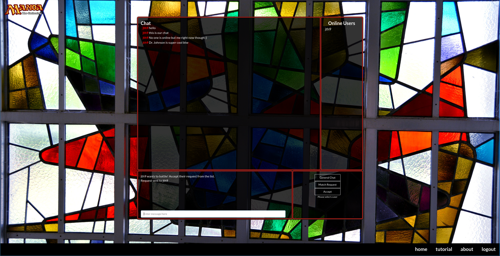
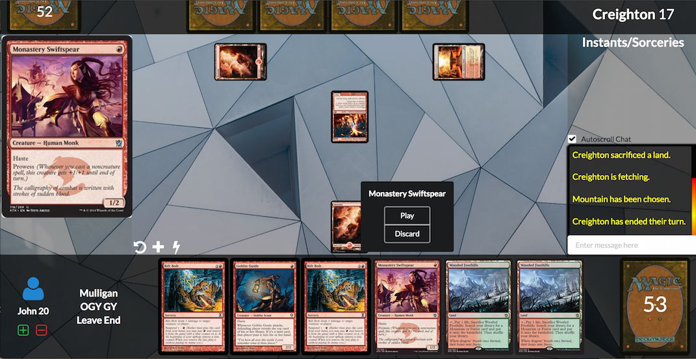

Manoa The Gathering is my first Meteor application as a test of skills. It was also my first time in
adhering to Issue Driven Project Management practices that are commonly used through large software engineering
projects. It is a simulation of the official Magic: The Gathering Trading Card Game, but with card flavors centered around UH
Manoa instead. Using the power of Meteor's reactive collections, we successfully created a functional
chat room that normally would have required some SQL Database work to save messages. Meteor's ability
to achieve full stack web development with just basic javascript made it easy to set up server methods
to manage collections and publish them to clients on demand.

## The Chat Room (2016)

My coding contributions to this project was mostly front-end development. I was reponsible for the overall application design and layout, creating Semantic-Ui containers and combining all the functionalities together in a cohesive package. Back-end parts I was reponsible for is the management of the online users as seen above in the chat page. Luckily, someone had already created a Meteor package that can easily grab the status of logged in users to determine if they were still online, just like a real chat room. My teammates coded up the basic chat functionality and user authentication through the help of some tutorials, along with creating the cards. The chat room also has support for private direct messaging.

## 2017 Update. Working Battle system, Matchmaking

In 2016, all we were able to get working was an online chatroom application. The following semester, I decided to continue development of this Meteor Application myself. I reworked the existing battle page and implemented a working dueling system and matchmaking system. Cards can be drawn and played, with automatic reactive updates through the use of MongoDB.

## Learning Experience

The most valuable thing I got out of this project is the skills to create a fully functional Meteor application that
got deployed to Galaxy, a PaaS for Meteor applications. Unfortunately there isn't funding available at the moment to maintain
it on Galaxy's servers after 2016. I learned how to manage multi-user interactions which was something I never done before. My
previous web development experiences were all limited to static webpages served to single users at a time. I had no knowledge of SQL database management, but I didn't need it thanks to Meteor's abstraction through JavaScript.

### Project homepage
Check out the <a href="https://manoa-the-gathering.github.io/">project homepage</a> for more information.

Application has been moved to the Heroku Platform due to Galaxy costs.

### Project on Github for developers
<a href="https://github.com/manoa-the-gathering/manoa-the-gathering.github.io">The Github repository for interested developers.</a>
