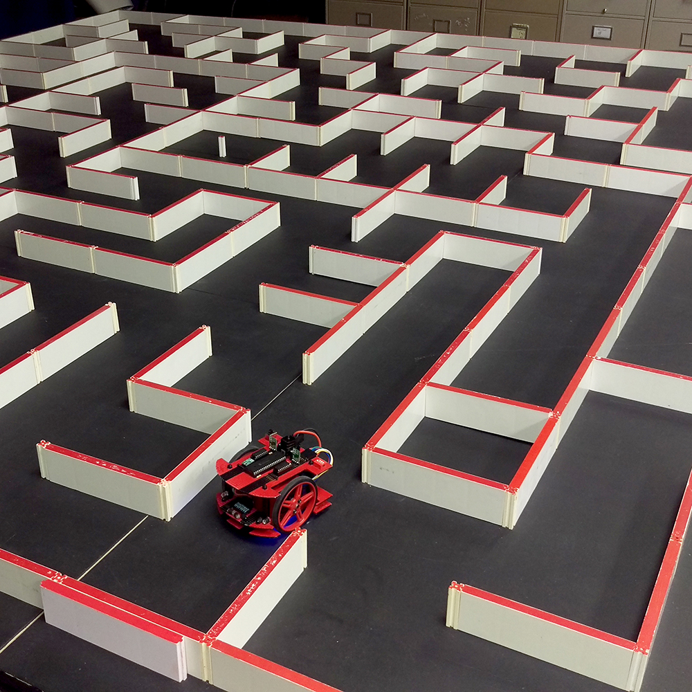

  
  
  

Micromouse is an event where small robot “mice” solve a 16 x 16 maze.  Events are held worldwide.  The maze is made up of a 16 by 16 grid of cells, each 180 mm square with walls 50 mm high.  The mice are completely autonomous robots that must find their way from a predetermined starting position to the central area of the maze unaided. The only aid that was allowed were the use of sensors on the mice to tell it where to go. The mouse will need to keep track of where it is, discover walls as it explores, map out the maze and detect when it has reached the center.  having reached the center, the mouse will typically perform additional searches of the maze until it has found the most optimal route from the start to the center.  Once the most optimal route has been determined, the mouse will run that route in the shortest possible time.

Apart from the maze competition, there is also a side competition to determine which robot has implemented its components in the best way possible. Many aspects are evaluated, such as thermal heat levels, noise generated during operation, weight, size, component arrangement, costs of components, power management, etc.

For this project, I was hardware lead who was responsible for designing and building the robot. All parts were obtained separately from various manufacturers. The chassis was cut down to size and built by our own hands. I worked closely with my other team members that were in charge of programming the robot, and picked up the knowledge of how to do it myself as well. Around eight chassis versions were made until we came to the final chassis shown above. We also had enough room in our $300 budget to buy some paint to make it aesthetically pleasing.

One year later, the 2016 IEEE Region 6 Central Area competition was going to be held in the University of Hawaii for the first time in 20 years. My team decided to enter our previous robot in the competition. Unfortunately, my team members did not have the time to make improvements. I made some minor adjustments to the chassis and the underlying maze solving algorithm. I attempted to create a flood fill algorithm, but it did not work very well. However, the robot still managed to get us 4th place amongst other schools that came from the mainland to participate. 

The aesthetically pleasing robot also got us 2nd place in the Best Packaging Competition. I feel that it would have won first place if we invested in higher quality motors that ran quieter.

You can learn more at the [UH Micromouse Website](http://www-ee.eng.hawaii.edu/~mmouse/about.html).

