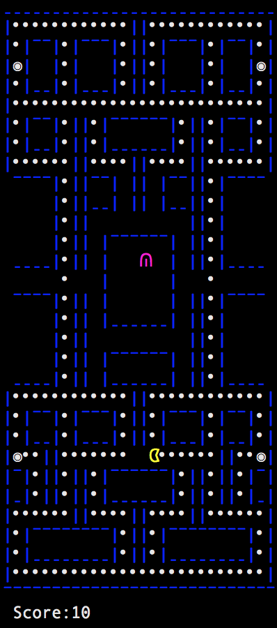

For my EE205 Object Oriented Programming class, the final project that my team chose to work on was a C++ implementation of Pacman. Since creating complex GUIs were outside of the scope of the class, the graphics were limited to the command shell.
I made full use of the termios.h library and ANSI Escape codes to make it as visually appealing as possible. We did not use the popular curses library and wrote our own graphical functions using escape codes. This project helped me learn how to use classes, complete with constructors and accessors.

The map was printed out character by character to mimic the Pacman maze. Using escape codes, the command shell cursor was moved in the 2D space to print out the appropriate game updates instead of reprinting out the entire game map.

The game only has one ghost implemented due to time constraints. Rather than using an algorithm of where the ghosts picks a random cell to occupy everytime, it uses a simple formula to calculate the shortest distance between itself and the player.
Small Code Excerpt: (Full code can be found in the source link at the bottom of the page)

 // If it is possible to move up
   if(m.isValidPosition(enemyy()-1, enemyx()))
   {
           //Find distance to pacman
           dist1 = sqrt(pow(abs(enemyy()-1 - p.position1()), 2) + pow(abs(enemyx() - p.position2()), 2));
   }
   
   // If it is possible to move down
   if(m.isValidPosition(enemyy()+1, enemyx()))
   {
           //Find distance to pacman
           dist2 = sqrt(pow(abs(enemyy()+1 - p.position1()), 2) + pow(abs(enemyx() - p.position2()), 2));
   } 

   // If it is possible to move left
   if(m.isValidPosition(enemyy(), enemyx()-1))
   {
           //Find distance to pacman
           dist3 = sqrt(pow(abs(enemyy() - p.position1()), 2) + pow(abs(enemyx()-1 - p.position2()), 2));
   }

   // If it is possible to move right
   if(m.isValidPosition(enemyy(), enemyx()+1))
   {
           //Find distance to pacman
           dist4 = sqrt(pow(abs(enemyy() - p.position1()), 2) + pow(abs(enemyx()+1 - p.position2()), 2));
   }
}

Also, the "power" dots that give the player the ability to eat the enemies like in the original game has been converted to just award the player with more points. Random tomatoes were also implemented to award the player extra points as well if consumed. The ghost can also "steal" the fruit from the player if it gets to it first.

A Linux and Windows executable was compiled in the end to allow for direct execution without calling on it from the shell.
 
Source: <a href="https://github.com/cj38/205Project"><i class="large github icon"></i>EE205 Final Project Source</a>
