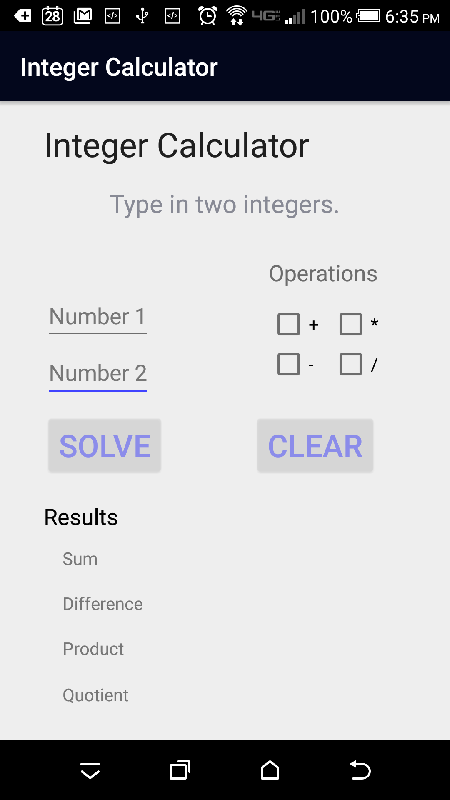
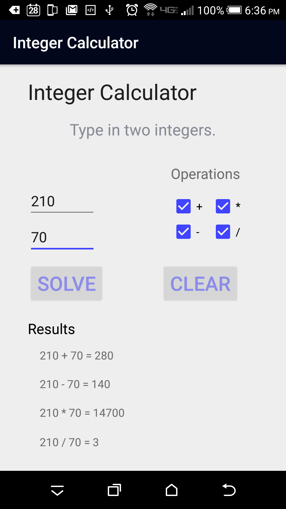

## Android Development
I always wanted to learn how to be able to code mobile applications and immediately signed up for a Android developemnt course that was available to Computer Engineers at Manoa. Although most of the learning has been through self study, I was provided an Android Tablet that could be used to help test my apps free of charge, since the simulator in the SDK was not the greatest. Unfortunately, there was no iOS curriculum since to develop iOS apps, one needed to pay money for a developer license and the apps made will need to go through an approval process by Apple. Google Play's open market makes it much easier to get applications out there to get more experience with the mobile application field.

This simple Integer Calculator is a quick app that I developed for Android to become more familiar with the Android SDK. I am still in the midst of an Androird Development Curriculum and will develop a more polished app once my skills have improved. It uses a simple interface of where one enters two numbers, check what operations they want to be done upon the numbers, and obtain the results instantly on the bottom. It handles errors by issuing messages through "toast" like not entering numbers before solve and division by zero. 

So far, I learned how to compile simple Android applications ready for deployment. Although this application only uses one activity, I plan to implement more activities later. I probably will not publish this on the play store since one would probably find a full function calculator much more useful instead, but I mainly did this just to reinforce what I had learned.

Source: <a href="https://github.com/cj38/cj38.github.io/releases/tag/1.0"><i class="large github icon "></i>Integer Calculator APK Download</a>

