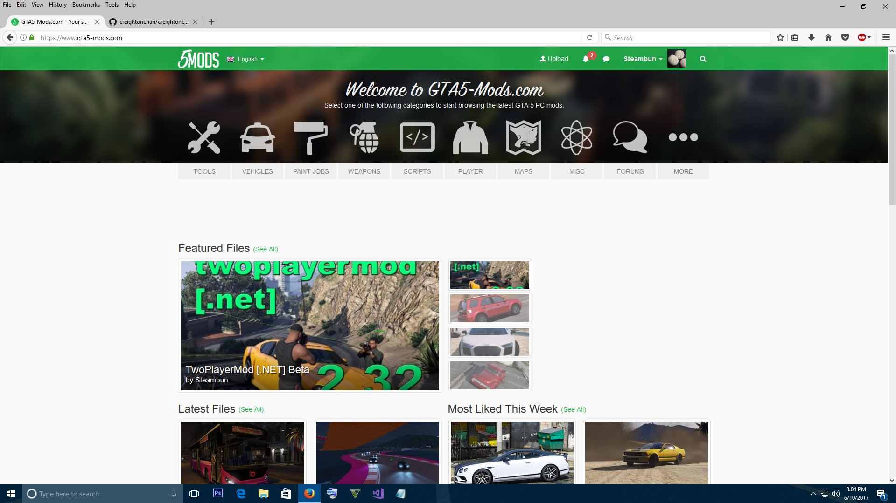

## Initial Motivation
I decided to apply my coding skills to a favorite game of mine, Grand Theft Auto V. The original author, Benjamin94 provided the backbone for this two player
functionality over one year ago and with my free time I decided to learn how to code scripts for video games. There were many problems and it was not completely playable, but the idea
was there. Also the author made it open source and gave me permission to work on it. The language of choice was in C#, a language I was unfamiliar with, so it was back to tutorials to learn a new programming language. Spent the next entire following week to
code, test, and debug the new features I added, learning C# as I went. I already have previous programming experience with C/C++/Java/JS a though, and soon released a new version.

Within a week, the initial mod that has been left buggy for over an year, quickly rose to become a featured file on the popular GTA5-Mods
website. I was pleased to see mostly positive reception. Still in beta phase as I continue to improve/add more features.

GTA 5 mod: <a href="https://www.gta5-mods.com/scripts/twoplayermod-net-beta">TwoPlayerMod 2.3 Beta</a>

